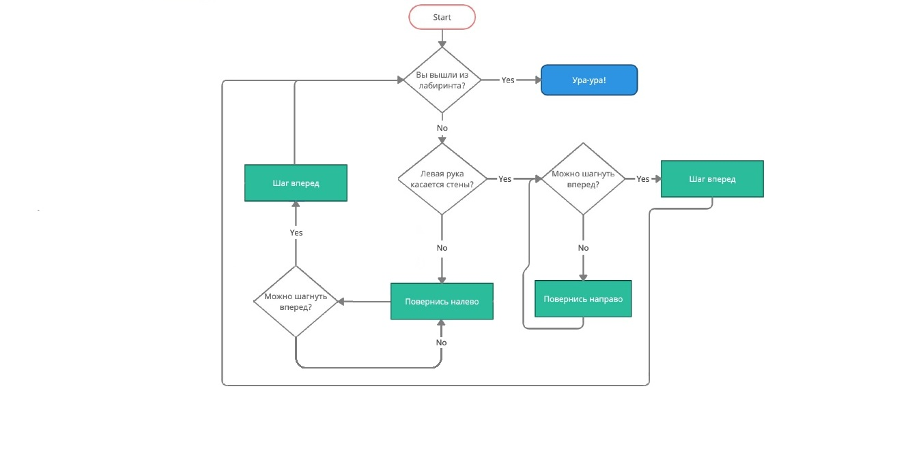

# Инструкции для работы с Markdown

## Выделение текста

Чтобы выделить текст курсивом необходимо пометить его звездочками с обеих сторон (*) или знаком нижнего подчеркивания (_). Например *вот так* или _вот так_

Чтобы выделить текст полужирным шрифтом, необходимо обрамить его двойными звездочками (**) или с двойным знаком нижнего подчеркивания (__). Например **вот так** или __вот так__

Альтернативные способы выделения текста жирным или курсивом нужны для того, что бы могли совмещать оба этих способов. Например, _текст может быть выделен курсивом и при этом быть **подчеркнутым**.

## Списки

Чтобы добавить ненумированые списки необходимо пункты выделить (*). Например, вот так:
1. первый пункт
2. Второй пункт
  ненумерованный список, используйте (*)

## Работа с изображением

Чтобы вставить изображение в текст, достаточно написать следующие:

## Ссылки

## Работа с таблицами

## Цитаты

## Работа с удаленными репазиториями
1. Создать аккаунт на Github.com
2. Создать локальный репозиторий
3. "Подружить ваш локальный и удаленый репозитории. Github при создании нового репозитория подскажет как это сделать
4. Отправить (push) ваш локальный репозиторий в удаленный (на Github), при этом вам, возможно, нужно будет авторизоваться на удаленном репозитории.
5. Провести изменения с "другого компьютера"
6. Выкачать (push) актуальное состояние из удаленного репозитория

## Заключение
Всем пока!
Good bay

